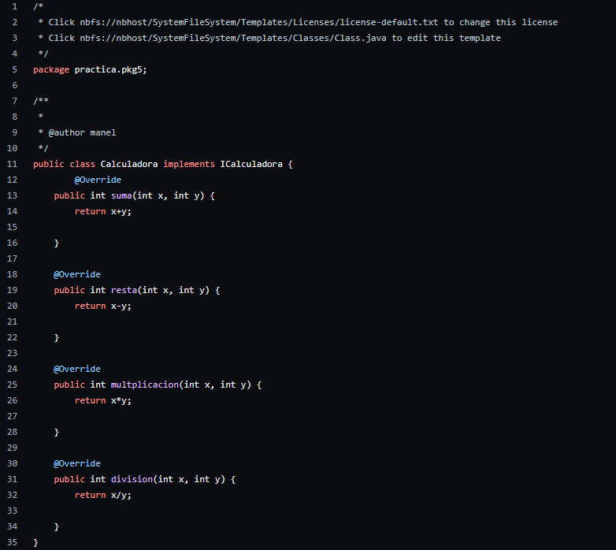
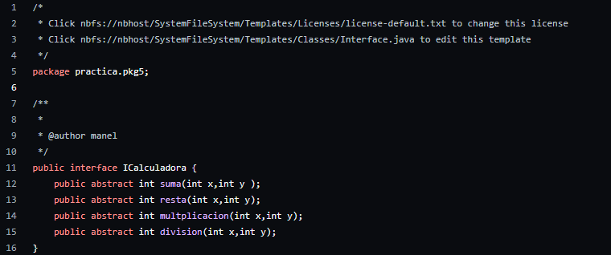
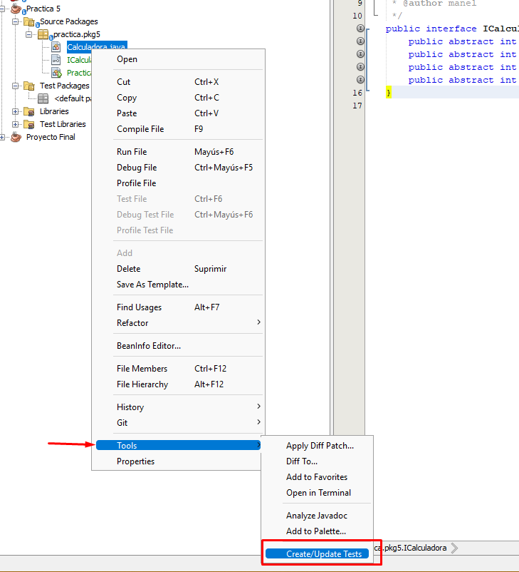
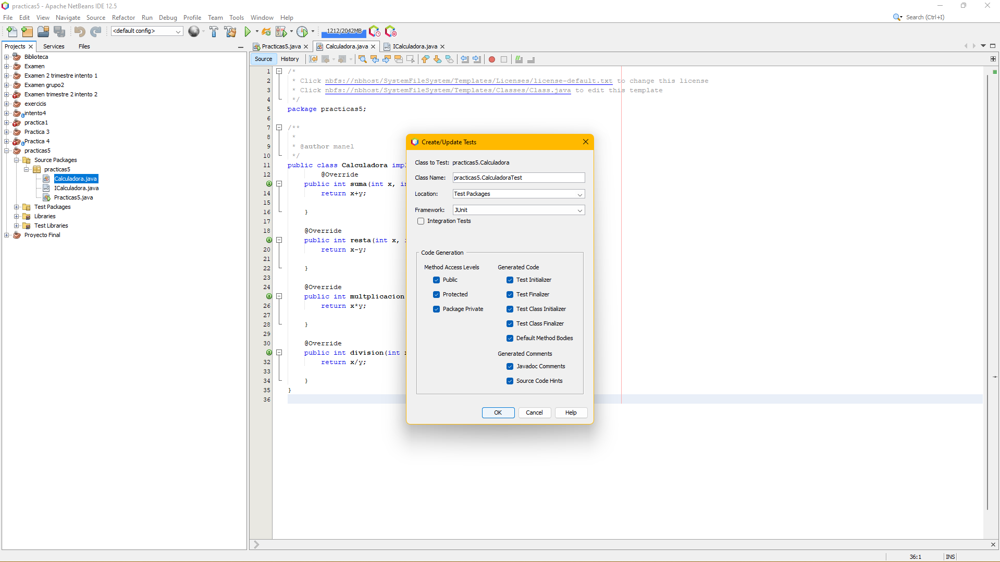
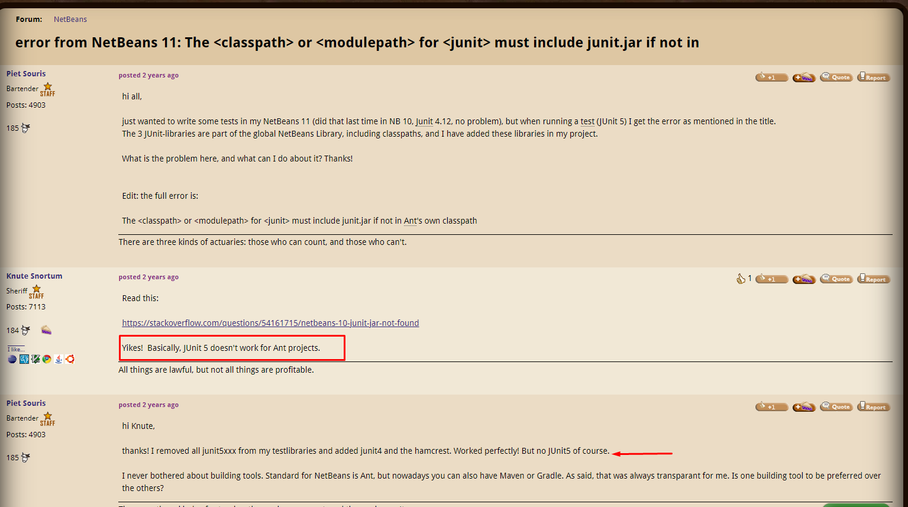
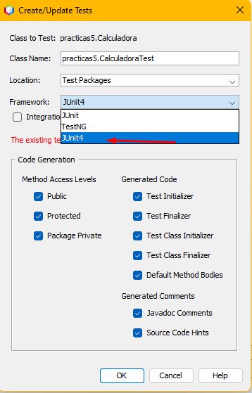
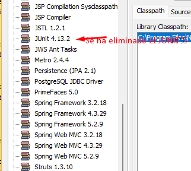
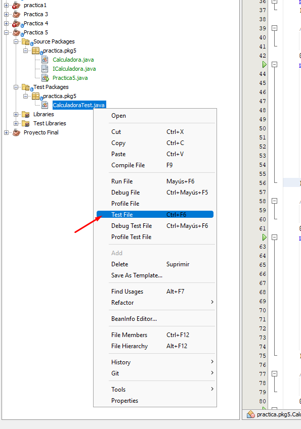
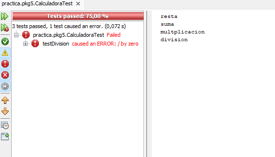
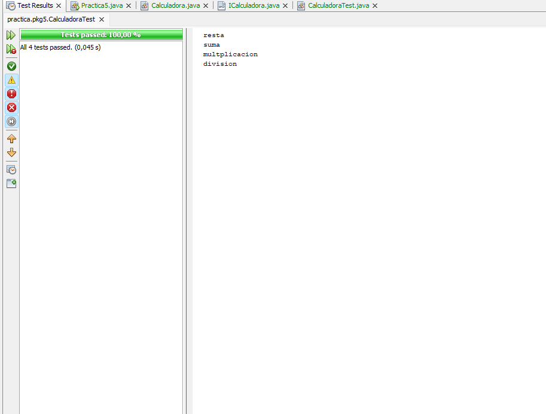

# Practica5

CORTAVARRIA ,José Noel
ZAMBRANA ,Manel

Después de la creación de la clase Calculadora debemos implementar mediante la palabra reservada de Java ‘’Implement’’ , la Interfaz ICalculadora creada previamente con los métodos creados pero no implementados.

Son cuatro métodos simples Suma , resta , multiplicación y división:

Clase Calculadora con la interfaz implementada;

Interfaz

Después de finalizar tanto la clase como la interfaz deberemos crear los test JUNIT.

Para comenzar debemos dar click derecho en  la clase en la que queremos crear los métodos → Acceder a Tools → Create/Update Tests , y se creará una carpeta con la paquetería y la clase test.

Nuestro IDE nos generará automáticamente el código .

Previamente nos toparemos con el problema de que JUNIT 5  ,no es compatible y da errores con  Java Ant Application. Para solucionarlo deberemos eliminar de las librerias el JUNIT5 e instalar las dependencias del JUNIT 4. 

Usaremos el FRAMEWORK de JUNIT4

Luego ejecutaremos el test

Test File:

Para finalizar hemos realizado pruebas , la primera ha dado un error en uno de los cuatro métodos debido a la ausencia de un valor.

Luego de arreglar el error,  (simplemente dando valores a la x y a la y )  , realizamos un último test

